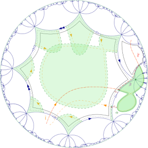

[Page d'accueil](/index.html)

# Groupe de travail "théorie de jauge et surfaces aléatoires", année 2023-2024

## Description

L'objectif de ce groupe de travail est d'étudier les travaux récents de Cao, Park, Pfeffer, Sheffield et Yu, qui appliquent des techniques de surfaces aléatoires à la théorie de Yang-Mills : [https://arxiv.org/abs/2305.02306](https://arxiv.org/abs/2305.02306) et [https://arxiv.org/abs/2307.06790](https://arxiv.org/abs/2307.06790). Il se déroulera les lundis de 10h à 12h en salle de séminaire au 3ème étage du bâtiment M3.

## Emploi du temps

- Séance 1 (09/10/23) : Introduction. Mesure de Yang-Mills discrète en deux dimensions (Thibaut Lemoine)
- Séance 2 (23/10/23) : Mesure de Yang-Mills continue, boucles de Wilson (Thibaut Lemoine)
- Séance 3 (06/11/23) : Mouvement brownien sur U(N) (Mylène Maïda)
- Séance 4 (13/11/23) : Formule de Wick (Martin Rouault)
- Séance 5 (20/11/23) : Représentation poissonnienne des boucles de Wilson (Martin Rouault)
- Séance 6 (27/11/23) : Cartes combinatoires (Thibaut Lemoine)
- Séance 7 (04/12/23) : Représentation des boucles de Wilson comme sommes sur des surfaces (Thibaut Lemoine)
- Séance 8 (12/02/24) : Propriétés des boucles de Wilson (Mylène Maïda)
- Séance 9 (19/02/24) : Equations de Makeenko-Migdal (Thibaut Lemoine)
- Séance 10 (11/03/24) : Equations de Makeenko-Migdal II (Thibaut Lemoine)
